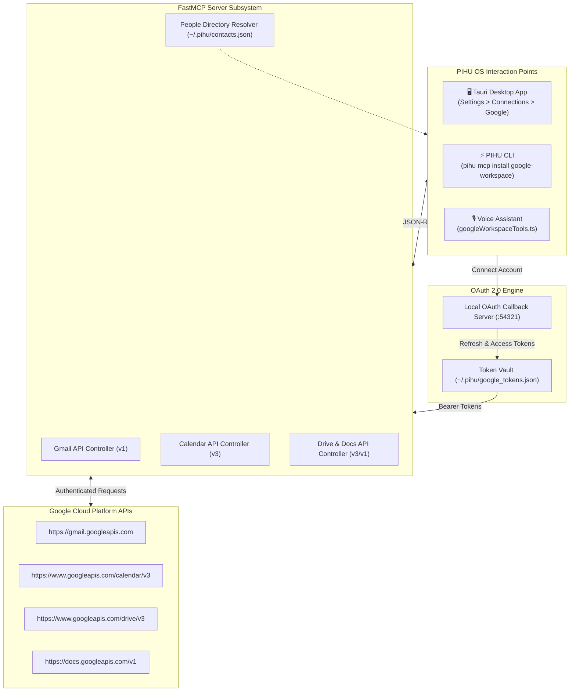

# PIHU Google Workspace MCP — Complete Integration Guide

## 1. Overview & System Purpose

The **PIHU Google Workspace MCP Subsystem** empowers **PIHU OS** with autonomous control over personal and enterprise Google Cloud accounts, covering **Gmail**, **Google Calendar**, **Google Drive**, **Google Docs**, and **Google Tasks**.

It supports **multi-account authentication**, seamless contact resolution via the shared People Directory (`~/.pihu/contacts.json`), and natural language voice execution.

---

## 2. Architecture & Security Model

---

## 3. Multi-Account OAuth Protocol

1. **Authentication Initiation**:
   - The user clicks **Connect Google Account** in Settings or commands the Voice Assistant.
   - PIHU spawns a local ephemeral loopback OAuth server on `http://localhost:54321`.
2. **Browser Authorization**:
   - The system browser opens Google's OAuth consent screen with requested scopes (`gmail.send`, `gmail.readonly`, `calendar`, `drive.file`, `documents`).
3. **Token Management**:
   - Encrypted refresh tokens and account metadata (`email`, `name`, `picture`, `isPrimary`) are persisted in `~/.pihu/google_tokens.json`.
   - Users can connect multiple accounts and switch the active primary account anytime in Settings.

---

## 4. Unified Contact Resolution

When commanding PIHU to send an email (e.g. *"Email Anin the project architecture"*):

1. The MCP tool checks if the recipient string contains an `@` symbol.
2. If not, it queries `~/.pihu/contacts.json` and matches against:
   - Full name (e.g. "Anin")
   - Nicknames / aliases
   - Associated email fields
3. The email is automatically populated and sent through the active primary Google account without requiring the user to look up email addresses manually.

---

## 5. Tool Catalog

### 📧 Gmail
- `send_email(recipient, subject, body)`: Sends formatted emails to addresses or saved contacts.
- `search_emails(query, max_results)`: Performs advanced Gmail searches.
- `read_email(message_id)`: Extracts email body, subject, sender, and date.
- `list_drafts()`: Returns open drafts.

### 📅 Calendar
- `list_events(time_min, time_max, max_results)`: Fetches upcoming schedule.
- `create_event(summary, start_time, end_time, attendees)`: Books a new calendar meeting.
- `delete_event(event_id)`: Cancels and removes events.

### 📁 Drive & Docs
- `search_drive(query)`: Finds files in Google Drive.
- `read_doc(document_id)`: Reads document text.
- `create_doc(title, content)`: Creates a new document with specified body.

---

## 6. Voice Execution Examples

- *"PIHU, email Anin saying the build is complete"*
- *"Check my calendar for tomorrow morning"*
- *"Create a Google Calendar event called Team Sync on Friday at 4 PM"*
- *"Find the design document on Google Drive"*
