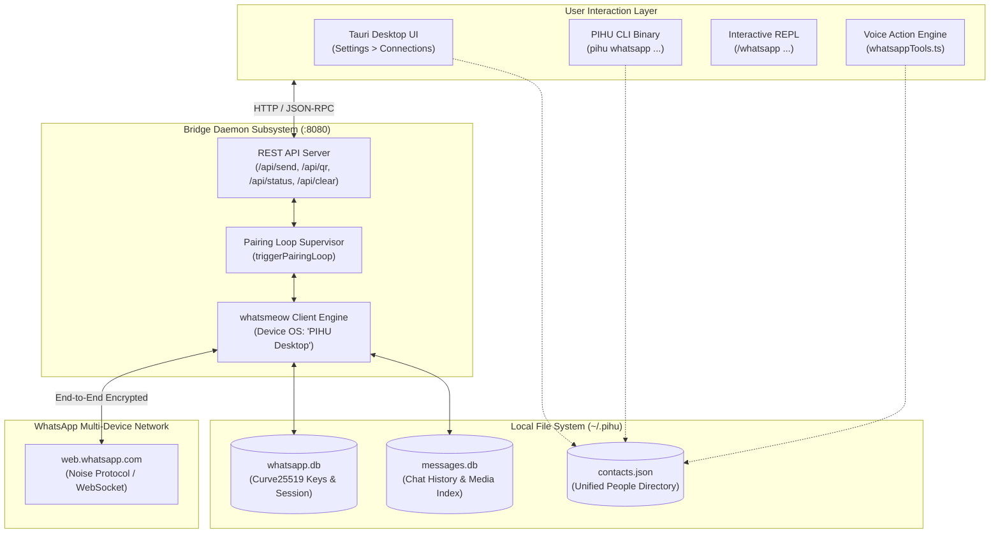

# PIHU WhatsApp MCP — Complete Integration Guide

## 1. Overview & System Purpose

The **PIHU WhatsApp MCP Subsystem** bridges the **PIHU OS** intelligent desktop environment (Tauri UI, CLI, REPL, and Voice Action Engine) with the personal WhatsApp messaging network.

It operates using an **asynchronous multi-device bridge** written in Go ([`whatsmeow`](https://github.com/tulir/whatsmeow)) paired with a **Python FastMCP server**, enabling autonomous AI agents to search contacts, send formatted messages, stream audio voice notes, download media, and inspect chat history.

---

## 2. Core Architectural Principles

### Key Architectural Tenets:
1. **Single Source of Truth**: All clients connect to the single bridge daemon on `http://localhost:8080`.
2. **Canonical Data Directory (`~/.pihu/whatsapp/`)**: Database files (`whatsapp.db` and `messages.db`) reside in `~/.pihu/whatsapp/`, ensuring session consistency across all invocation contexts.
3. **Local-First & Zero Proxy**: All cryptographic handshakes and message logs remain 100% on the user's local machine.

---

## 3. Pairing & Authentication Lifecycle

1. **Detection**:
   - The daemon checks `~/.pihu/whatsapp/whatsapp.db`. If unlinked or if WhatsApp returns `EOF` (session revoked), the daemon automatically deletes stale credentials and begins the non-blocking pairing loop.
2. **QR Code Generation**:
   - `whatsmeow` requests a pairing session from WhatsApp and streams the QR code string to the in-memory state.
   - The string is formatted simultaneously as:
     - High-contrast ASCII half-block terminal graphics (`qrterminal.GenerateHalfBlock`).
     - Real-time JSON on `http://localhost:8080/api/qr` for the Desktop Settings UI.
3. **Handshake & Verification**:
   - When scanned on a phone (**Settings > Linked Devices > Link a Device**), WhatsApp performs the Noise-protocol key exchange.
   - The device registers as **PIHU (Desktop)**.
   - State flips to `connected = true, logged_in = true` across all frontend widgets and CLI commands.

---

## 4. Unified Contact Resolution

When a user instructs PIHU to message a person (e.g. *"Send a message to Anin"*), the multi-tiered contact resolver searches:

1. **Local People Directory (`~/.pihu/contacts.json`)**:
   Matches names, nicknames, and aliases. If a 10-digit Indian phone number is found without country prefix, `91` is prepended automatically.
2. **Live WhatsApp Chats & Groups (`/api/chats`)**:
   Searches all known group names (`@g.us`) and individual conversations (`@s.whatsapp.net`).
3. **Direct E.164 Numbers**:
   Normalizes strings with international calling codes (e.g. `+919926674532`).

---

## 5. CLI & REPL Command Matrix

| Interface | Command | Functionality |
| :--- | :--- | :--- |
| **CLI** | `pihu whatsapp auth` | Spawns bridge if inactive and displays interactive terminal QR code. |
| **CLI** | `pihu whatsapp status` | Prints real-time connection status and linked account JID. |
| **CLI** | `pihu whatsapp send <contact\|number> "<msg>"` | Resolves recipient and sends WhatsApp message. |
| **CLI** | `pihu whatsapp clear-data` | Purges local database and resets session. |
| **CLI** | `pihu whatsapp logout` | Gracefully unlinks session from WhatsApp server. |
| **REPL** | `/whatsapp auth` | Renders a styled Catppuccin QR card in the chat view. |
| **REPL** | `/whatsapp status` | Displays live telemetry badge inside the chat. |
| **REPL** | `/whatsapp send <target> <msg>` | Submits WhatsApp message as an autonomous agent turn. |
| **REPL** | `/whatsapp clear-data` | Wipes session tokens and chat database. |

---

## 6. Voice Action Engine Tools

- `whatsapp_send_message(recipient, message)`: Resolves recipient, validates bridge connectivity, and dispatches message.
- `whatsapp_authenticate()`: Automatically opens Settings Connections tab and initiates pairing mode.
- `whatsapp_get_status()`: Verifies if WhatsApp is connected or requires phone pairing.
- `whatsapp_search_contacts(query)`: Searches across contacts and group conversations.
- `whatsapp_clear_data()`: Manually clears local databases and resets session.
