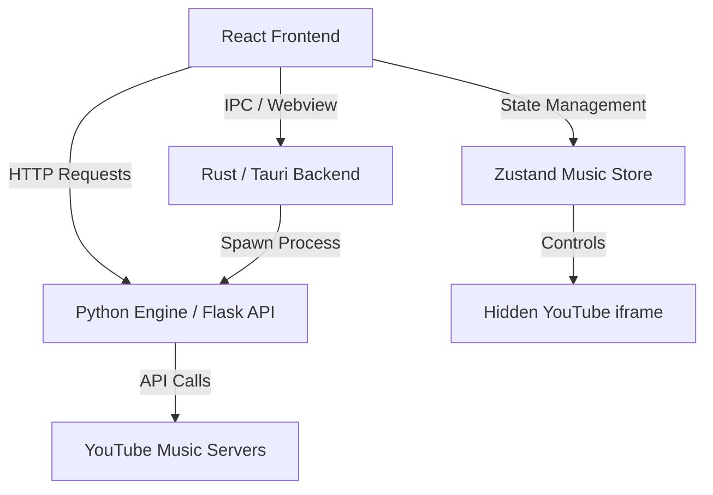

# YTMusic Architecture in PIHU OS

The YTMusic integration in PIHU OS provides a full-featured YouTube Music client with background playback, desktop widgets, and a rich user interface. The architecture is split across three main layers: a Rust/Tauri backend, a Python local API server, and a React frontend (which includes both a plugin window and floating widgets).

## 1. High-Level Architecture

## 2. Python Engine (`ytmusic_server.py`)

To bypass CORS restrictions and complex authentication hurdles directly in the browser, PIHU OS spins up a local Python server using Flask on port `48123`.

- **Library**: It utilizes the `ytmusicapi` Python package to scrape and interact with YouTube Music.
- **Endpoints**: Exposes REST endpoints like `/home`, `/explore`, `/search`, `/playlists`, and `/playlist_details`.
- **Fallbacks**: When searching for tracks, if official endpoints fail, it can fall back to alternative instances (like Invidious or Piped) to resolve YouTube video IDs.
- **Authentication**: Implements a TV-based OAuth 2.0 Device Flow, allowing users to log into their actual YouTube accounts to retrieve liked songs and personalized recommendations.

## 3. Rust / Tauri Backend (`ytmusic.rs`)

The Tauri backend acts as the orchestrator for the desktop environment.

- **Process Management**: On startup (`main.rs`), Tauri calls `start_ytmusic_engine()` which spawns the `ytmusic_server.py` script as a detached child process using `std::process::Command`.
- **Logging**: It captures `stdout` and `stderr` from the Python server and pipes them directly into the Rust console for debugging.
- **Webview Generation**: When the user initiates the OAuth login flow, Tauri dynamically spawns a new `WebviewWindow` to display the Google verification page, ensuring the user doesn't have to leave the OS environment to log in.

## 4. Frontend: Plugin Window vs. Widgets

The frontend UI is bifurcated into two main experiences that share the same global state.

### Global State & Playback (`GlobalMusicProvider.tsx` & `musicStore.ts`)
- **Zustand Store**: `useMusicStore` holds the global music state (`isPlaying`, `progress`, `trackInfo`, `playlistId`).
- **Hidden Player**: The actual audio playback is handled by a hidden `react-youtube` iframe component mounted inside `GlobalMusicProvider`. This allows music to play uninterrupted across the entire OS, regardless of which windows are open.
- **Auto-Pause**: If all music widgets and the plugin window are closed, the provider automatically pauses the music.

### The Plugin Window (`YTMusicPlugin.tsx`)
This is the "full app" experience.
- Acts as a traditional desktop window using the `PluginWindow` component.
- Connects to the local Python API (`http://127.0.0.1:48123`) to render the Home feed, Explore page, Moods, and user Library.
- Features a search bar and complex grid/carousel layouts.
- When a user clicks a song or playlist here, it dispatches the `videoId` or `playlistId` to the `useMusicStore`, which triggers the hidden iframe to start playing.

### The Desktop Widgets (`MusicWidget.tsx`, etc.)
These are minimal, always-on-top controls.
- Variants include Circular, Compact, Folder, and Horizontal styles.
- They do not handle heavy API requests or browsing.
- They solely subscribe to `useMusicStore` to display the current track's metadata (Title, Artist, Album Art).
- Provide quick media controls (Play, Pause, Skip, Prev) and seek bars.

## 5. Authentication Flow

The OAuth 2.0 flow is specifically tailored for "TV & Limited Input Devices" to bypass strict Google security policies on desktop apps.

1. **Start**: User clicks "Sign In" in the Plugin Window. React calls `GET /auth/start` on the Python server.
2. **Code Generation**: Python requests a device code from Google and returns a `verification_url` and a `user_code`.
3. **Popup**: React copies the code to the clipboard and asks Tauri to open a `WebviewWindow` pointing to the `verification_url`.
4. **Polling**: React begins polling `POST /auth/verify` with the `device_code`.
5. **Approval**: The user pastes the code in the Tauri window and approves access.
6. **Token Save**: The Python server receives the token, saves it locally to `~/.pihu-os/ytmusic_oauth.json`, and returns success to React.
7. **Refresh**: The React UI updates to show authenticated routes (Library, Liked Songs).
