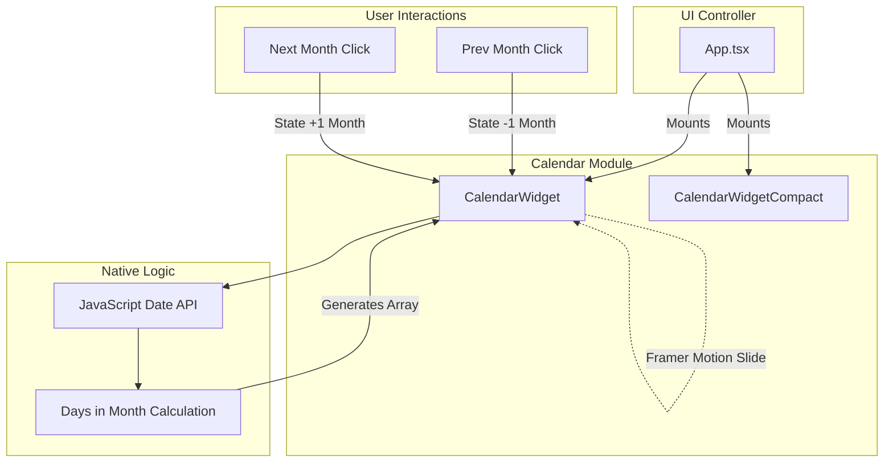

# Calendar Widget Architecture

The Calendar module provides date tracking, event scheduling overlays, and temporal orientation in a beautifully frosted, interactive grid layout.

## 🛠 Tech Stack & Dependencies

### Frontend (TypeScript / React)
- **UI Framework**: React 18
- **Date Manipulation**: Native JavaScript `Date` API (no heavy dependencies like `moment.js` or `date-fns` used to keep bundle size minimal).
- **Animations**: `framer-motion` - Handles page-slide animations when toggling between months.
- **Styling Hooks**: `useThemeStore` to dynamically shade current days and grid borders.

---

## 🏗 Architecture Diagram

---

## 🧩 Core Modules

### 1. `CalendarWidget.tsx`
The full interactive calendar. 
- **Grid Generation**: Dynamically calculates the first day of the week for the current month and pads the CSS Grid with empty `div`s so the 1st always lands on the correct weekday column.
- **State Management**: Uses `useState` to track the `currentViewDate`. Clicking next/prev month shifts this state, triggering a re-calculation of the month's grid array.
- **Glass Integration**: Wraps the grid in a `<GlassCard>` with a heavy frost effect so the background wallpaper subtly shines through the grid lines.

### 2. `CalendarWidgetCompact.tsx`
A minimized, focused presentation.
- Instead of a full 35/42-cell grid, it extracts the current day name, day number, and month into highly legible, large typography.
- Ideal for placing immediately next to the Clock widget for a unified Date/Time dashboard.
