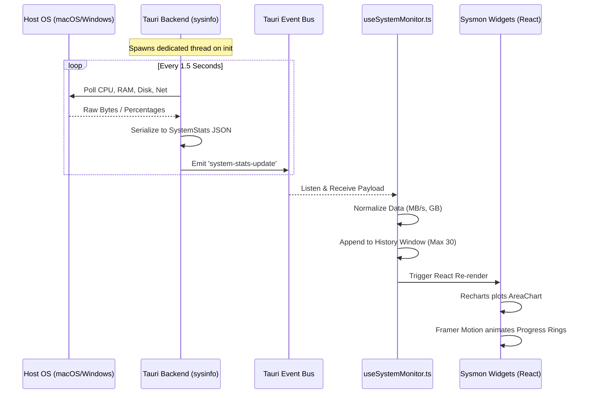

# System Monitor (Sysmon) Architecture

The System Monitor (Sysmon) module is a highly sophisticated, real-time telemetry dashboard for Pihu-OS. It seamlessly bridges the gap between low-level operating system hardware metrics and a fluid, high-performance React frontend.

## 🛠 Tech Stack & Dependencies

### Backend (Rust)
- **Framework**: Tauri (`tauri`)
- **Telemetry Crate**: `sysinfo` - Used to query cross-platform system information (CPU usage, Memory utilization, Disk I/O, Network Tx/Rx, Battery status).
- **Concurrency**: `std::thread` and `std::time::Duration` - Used to spawn a non-blocking asynchronous polling loop.

### Frontend (TypeScript / React)
- **UI Framework**: React 18
- **Data Visualization**: `recharts` - Used specifically for the `MiniAreaChart` to plot historical data with dynamic Y-axis scaling.
- **Animations**: `framer-motion` - Powers the `<CircularProgress>` SVG rings and layout transitions.
- **State Management**: React Hooks (`useState`, `useEffect`) and Global Store (`LayoutStore` for window positioning).

---

## 🏗 Architecture Diagram

The system operates on an event-driven architecture to prevent blocking the main thread while delivering 60FPS UI updates.

---

## 🧩 Core Modules

### 1. `src-tauri/src/system_monitor.rs`
This is the heart of the backend. It initializes a `sysinfo::System` instance. To ensure accurate delta calculations (like Disk Write speed or Network Read speed), it sleeps for an interval, calls `sys.refresh_all()`, and calculates the difference. It explicitly prevents APFS double-counting on macOS by filtering primary mount points.

### 2. `src/widgets/system/hooks/useSystemMonitor.ts`
The frontend synchronization hook. It maintains a `history` array to feed into Recharts. It also computes `safeProgress` metrics to ensure UI components never crash from `NaN` division errors if the backend stutters.

### 3. `src/widgets/system/components/MiniAreaChart.tsx`
A wrapper around Recharts. It intercepts the historical data array and calculates a `dynamicMax`. Instead of locking the Y-axis to a fixed byte size, it scales the chart dynamically +20% above the highest recent peak, ensuring network and disk spikes are always visible as beautiful mountains instead of flat lines.

### 4. `SystemLargeWidgets.tsx` & `SystemCompactWidgets.tsx`
The presentation layers. They wrap the visualizers in `WidgetContainer` (for desktop dragging/resizing) and `GlassCard` (for the blurred, frosted aesthetic powered by the global `ThemeStore`).
