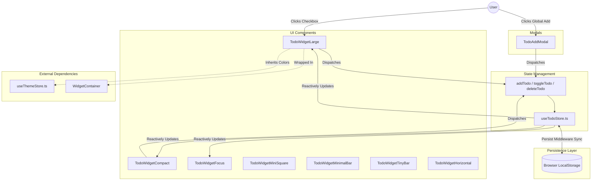

# To-Do Widget Architecture

The To-Do module provides a persistent, interactive, and highly customizable task management system. It is built to be lightweight, avoiding the need for complex backend databases by relying entirely on robust frontend local storage mechanics.

## 🛠 Tech Stack & Dependencies

### Frontend (TypeScript / React)
- **State Management**: `zustand` - Used for centralized, predictable state containerization.
- **Persistence**: `zustand/middleware` (`persist`) - Automatically syncs the Zustand store to `localStorage`.
- **Animations**: `framer-motion` - Used for `<AnimatePresence>` to orchestrate fluid list insertions, deletions, layout shifts, and spring-based modal scaling.
- **Icons**: `lucide-react` - Provides scalable, stroke-based SVG icons.
- **Layout & Sizing**: `react-rnd` - Powers the draggable, resizable `WidgetContainer` wrappers.

---

## 🏗 Architecture Diagram

The data flow is strictly unidirectional, adhering to standard React/Zustand best practices.

---

## 🧩 Core Modules

### 1. `useTodoStore.ts`
Defines the `Todo` interface (`id`, `text`, `completed`, `createdAt`, `project`, `tags`, `time`, `category`, `categoryColor`, `isStarred`) and initializes the Zustand store. The `persist` middleware wraps the entire store, hooking into the browser's storage engine. When the OS reloads, Zustand seamlessly hydrates the initial state before the first React render.

### 2. Global Modal (`TodoAddModal.tsx`)
A centralized, globally accessible modal that floats above the OS to quickly add tasks. It includes rich inputs for task name, project parsing, and tag selection, injecting them directly into the Zustand store.

### 3. Widget Variants
The To-Do system offers **7 distinct visual variants**, catering to different desktop arrangements. All variants inherit dynamic colors from `theme.colors.primary` and support native vertical/horizontal scrolling for overflow content.
- **TodoWidgetLarge.tsx**: The flagship UI. Includes tabs (`All`, `Today`, `Upcoming`, `Completed`), a top-right `CircularProgress` ring, and full metadata display (tags, stars, projects).
- **TodoWidgetCompact.tsx**: A cleaner, constrained vertical list with a circular progress indicator. Truncates long task names and strips out extra metadata (tags/stars) for a sleeker aesthetic. Default height is tuned to exactly fit 3 tasks, but can be resized and scrolled.
- **TodoWidgetFocus.tsx**: "Today" widget. Explicitly filters the global `todos` array to only show tasks scheduled for "Today" (or containing AM/PM). Like the Compact widget, it strips heavy metadata for ultra-fast reading.
- **TodoWidgetMiniSquare.tsx**: A highly compact card displaying raw completion metrics (e.g., "3 / 9 completed") alongside a scrollable list of tasks.
- **TodoWidgetHorizontal.tsx**: A wide, panoramic list view ideal for spanning across the bottom of the screen. 
- **TodoWidgetMinimalBar.tsx & TodoWidgetTinyBar.tsx**: Ultra-minimal horizontal bars that fit cleanly into tight grid layouts.

## ⚙️ Layout Behaviors & Scrolling

- **Scroll Physics**: In all variants, arbitrary hardcoded cutoff limits (like `.slice(0, 5)`) have been permanently removed. If tasks exceed the vertical height of the `WidgetContainer`, the container seamlessly degrades to a scrollable container (`overflow-y-auto`) via standard CSS Flexbox constraints (`min-h-0 flex-1`).
- **Drag & Resize Harmony**: The `WidgetContainer` handles drag gestures (`react-rnd`). To prevent the drag event from capturing scroll events inside the task lists, the `drag-handle` class is strictly isolated to the topmost visual header of each widget. This ensures users can drag the widget by the title, while safely scrolling through tasks inside the body.
- **Responsive Widths**: Most vertical widgets (Large, Compact, Focus, MiniSquare) are constrained with a hard `maxWidth={380}`. This ensures they align perfectly with the standard Clock and Weather widgets, establishing a strict, visually appealing grid system across the desktop regardless of user resize attempts.
