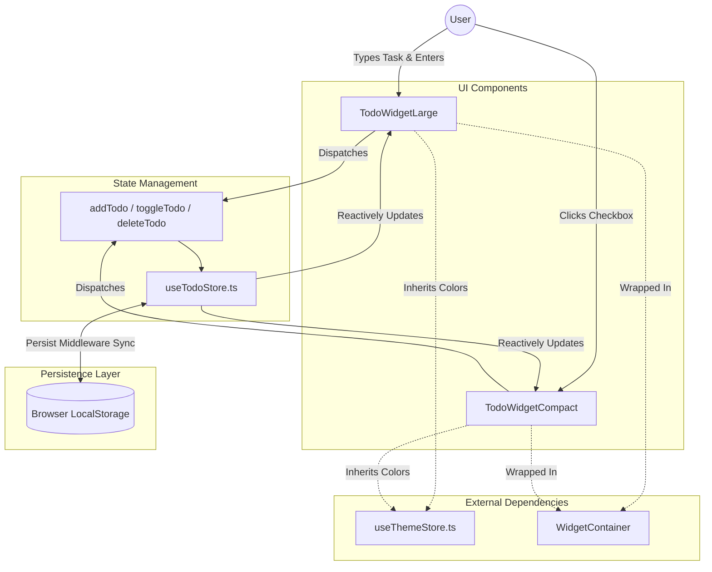

# To-Do Widget Architecture

The To-Do module provides a persistent, interactive task management system. It is built to be lightweight, avoiding the need for complex backend databases by relying entirely on robust frontend local storage mechanics.

## 🛠 Tech Stack & Dependencies

### Frontend (TypeScript / React)
- **State Management**: `zustand` - Used for centralized, predictable state containerization.
- **Persistence**: `zustand/middleware` (`persist`) - Automatically syncs the Zustand store to `localStorage`.
- **Animations**: `framer-motion` - Used for `<AnimatePresence>` to orchestrate fluid list insertions, deletions, and spring-based modal scaling.
- **Icons**: `lucide-react` - Provides scalable, stroke-based SVG icons (`Check`, `Trash2`, `Plus`, `ListTodo`).

---

## 🏗 Architecture Diagram

The data flow is strictly unidirectional, adhering to standard React/Zustand best practices.

---

## 🧩 Core Modules

### 1. `useTodoStore.ts`
Defines the `Todo` interface (`id`, `text`, `completed`, `createdAt`) and initializes the Zustand store. The `persist` middleware wraps the entire store, hooking into the browser's storage engine. When the OS reloads, Zustand seamlessly hydrates the initial state before the first React render.

### 2. `TodoWidgetLarge.tsx`
The primary interface. 
- **List Sorting**: Dynamically sorts tasks on every render—uncompleted tasks float to the top, and completed tasks sink to the bottom.
- **Dynamic Styling**: Inherits colors dynamically from `theme.colors.primary` and `theme.colors.surface` to tint the glowing checkboxes and input borders.

### 3. `TodoWidgetCompact.tsx`
A constrained view designed for glancing.
- **Derived State**: Filters the main `todos` array to only map over the first 3 uncompleted tasks.
- **Circular Progress**: Imports the Sysmon `CircularProgress` component to render a glowing ring representing the completion percentage of the *entire* list, even though only 3 items are visible.
