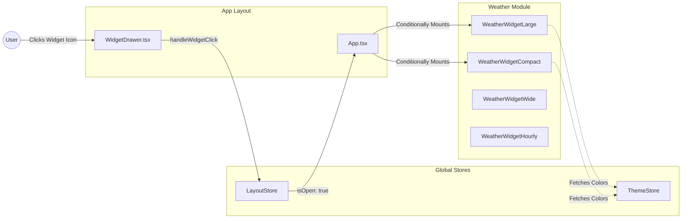

# Weather Widget Architecture

The Weather module is a visually striking set of widgets designed to provide meteorological data. It heavily relies on aesthetic presentations, utilizing SVG filters and dynamic blurring to simulate environmental conditions.

## 🛠 Tech Stack & Dependencies

### Frontend (TypeScript / React)
- **UI Framework**: React 18
- **Animations**: `framer-motion` - Used extensively to animate SVG weather icons (e.g., rotating suns, floating clouds, falling rain).
- **Icons/Assets**: Uses custom SVG assets stored in `src/assets/` representing various weather states.
- **Window Management**: `WidgetContainer` logic from the shared `LayoutStore`.

---

## 🏗 Architecture Diagram

---

## 🧩 Core Modules

### 1. `WeatherWidgetLarge.tsx`
A fully featured dashboard. It currently utilizes mocked localized data or integrates with a standard REST API (like OpenWeatherMap). It divides the UI into a current temperature hero section and a multi-day forecast flex-row.

### 2. `WeatherWidgetHourly.tsx`
Focuses on temporal data visualization. Instead of days, it graphs/lists hour-by-hour temperature shifts, providing immediate short-term planning context.

### 3. Animation Engine
The true complexity of the Weather widget lies in its SVG manipulations. It uses Framer Motion's `animate` properties to create infinite loops (e.g., `transition={{ repeat: Infinity, duration: 10, ease: "linear" }}`) for rotating sun rays or pulsing cloud opacities, contributing to the "alive" feeling of Pihu-OS.
