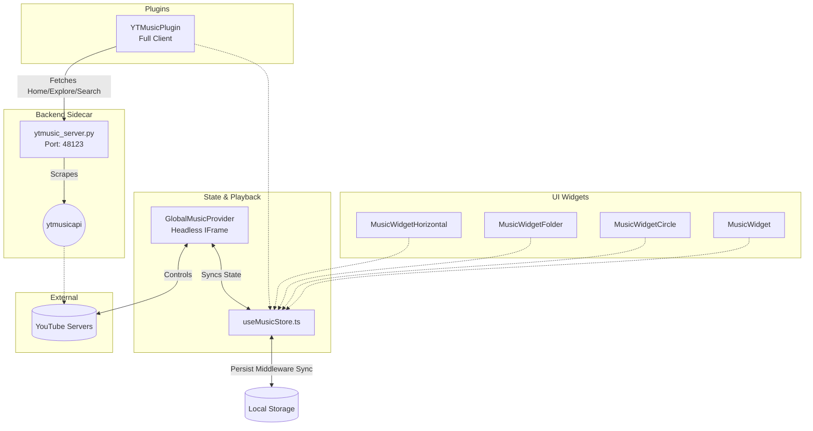

# YouTube Music Architecture

The YouTube Music module in Pihu-OS is a robust, full-stack integration that bridges an invisible YouTube IFrame API frontend with a powerful Python-based backend. It supports authentication, metadata fetching, playback persistence, and multiple UI paradigms ranging from tiny circular widgets to a full-blown desktop music client.

## 🛠 Tech Stack & Dependencies

### Frontend (React / Zustand)
- **Audio Engine**: `react-youtube` - Wraps the YouTube IFrame API in a headless configuration.
- **State Management**: `zustand` & `zustand/middleware` (`persist`) - Stores the global music state, queue, and playback timestamps.
- **Animations**: `framer-motion` - Powers the visual fluid transitions across all widget form-factors.
- **Windowing**: `PluginWindow` and `WidgetContainer` wrappers.

### Backend (Python / FastAPI / Tauri)
- **Engine**: `ytmusicapi` - A robust, reverse-engineered API client for YouTube Music.
- **Server**: Flask / FastAPI running on `127.0.0.1:48123` via a spawned Python sidecar in Tauri (`ytmusic_server.py`).

---

## 🏗 Architecture Diagram

---

## 🧩 Core Systems

### 1. The Headless Audio Engine (`GlobalMusicProvider.tsx`)
Rather than placing a YouTube iframe inside individual widgets (which would cause audio to stop if a widget was closed or remounted), Pihu-OS utilizes a **Singleton Headless Engine**.
- `GlobalMusicProvider` renders a 200x200 invisible `<YouTube />` component fixed to the DOM.
- **Timestamp Syncing**: Every second, it polls `player.getCurrentTime()` and pushes it to `useMusicStore`.
- **System Integration**: Automatically pauses music if a wake-word is detected by the OS, or if all music widgets are closed.
- **Persistence Resumption**: On OS boot, it intercepts the initial load, cross-references the saved `trackInfo` against the `playlistTracks`, calculates the correct `playerIndex`, grabs the saved `progress` timestamp, and injects `start: Math.floor(progress)` and `index: playerIndex` directly into the IFrame `playerVars`. It also reads the last `isPlaying` state to determine if it should `autoplay`.

### 2. The Storage Layer (`useMusicStore.ts`)
A Zustand store wrapped in `persist` middleware. It saves the following across OS reboots:
- `playlistId` & `listType` (Playlist/Video/Search)
- `playlistTracks` & `playlistMetadata` (To avoid re-fetching titles)
- `trackInfo` (Current song name, artist, ID)
- `progress` (Exact second the song was at)
- `isPlaying` (Whether the song was actively playing when the OS was closed)
- `likedSongs` & `savedPlaylists`

### 3. The Backend API (`ytmusic_server.py`)
A python-based microservice spawned by Tauri on port `48123`.
- **Auth**: Implements YouTube's OAuth device-code flow (`/auth/start`, `/auth/verify`).
- **Endpoints**: 
  - `/search`: Returns songs, albums, and playlists.
  - `/playlist_details`: Extracts all tracks from a YouTube or YTMusic playlist.
  - `/home`, `/explore`, `/library`: Fetches personalized shelves directly from the user's authenticated YTMusic account.

---

## 🖥 UI Form Factors

1. **YTMusicPlugin**: A massive, full-screen desktop client clone. It features a sidebar, Home feeds, Explore pages, personalized Library access, and a live search bar that queries the python backend as you type.
2. **MusicWidget**: The standard, medium-sized glassmorphism player with cover art and standard controls.
3. **MusicWidgetCircle**: An ultra-compact, spinning vinyl-style player that fits neatly into grid corners.
4. **MusicWidgetHorizontal**: A wide, slim taskbar-style player ideal for the bottom edge of the screen.
5. **MusicWidgetFolder**: An expanded view that reveals the full `playlistTracks` queue, allowing users to select specific tracks to jump to via the `playTrackAt` action.
